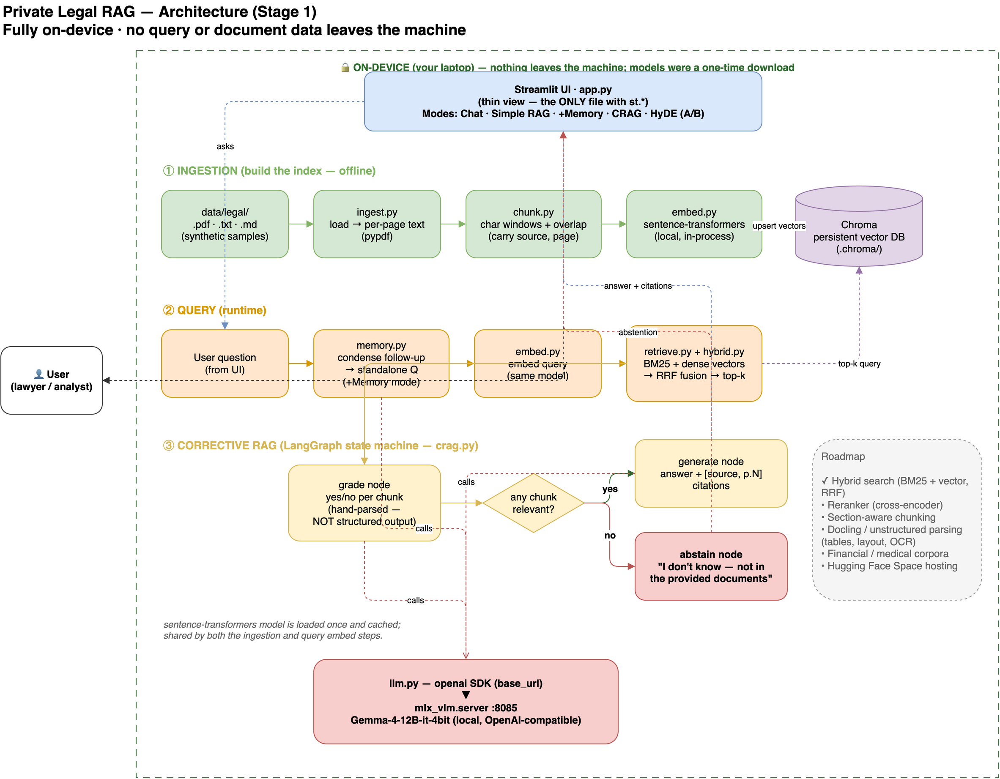

# Private Legal RAG — on-device retrieval over legal documents

A **fully on-device** Retrieval-Augmented Generation (RAG) chatbot for **legal documents**.
It runs against a **local** open LLM (Gemma-4-12B via `mlx_vlm.server`) with **local embeddings**
(sentence-transformers) and a **local** vector store (Chroma).

> **The thesis: privacy is the product.** Legal (attorney–client privilege), medical (HIPAA), and
> financial (compliance) work all *forbid* sending documents to third-party APIs. So *"runs fully
> on-prem — your documents never leave your infrastructure"* isn't a limitation here; it's the
> selling point. The same provider-agnostic core can later point at a hosted model for a public demo
> while the private deployment stays air-gapped.

**Honest privacy claim:** no query or document data leaves the machine *at inference*. The model
weights and the embedding model were one-time online downloads; after that the system runs offline.

GenAcademy "Mastering Agentic AI" — **Week 2 (Grounding AI with RAG & Context Engineering), Stage 1.**

---

## What it does

Five modes, selectable in the sidebar, building up the RAG patterns in order of value:

| Mode | Pattern | What it adds |
|---|---|---|
| **Chat** | — | Plain local model, no retrieval (baseline) |
| **Simple RAG** | Simple RAG | Retrieve top-k chunks → answer **with `[source, p.N]` citations** |
| **+Memory** | RAG with Memory | Condenses follow-ups ("what about *its* term?") into standalone questions before retrieving |
| **CRAG** | Corrective RAG | **Grades** each retrieved chunk for relevance; if none are relevant, **abstains** ("I don't know") instead of hallucinating |
| **HyDE (A/B)** | Hypothetical Document Embeddings | Drafts a hypothetical answer, embeds *that* to retrieve; shows raw-vs-HyDE retrieval side by side |

**CRAG is the differentiator** — the "won't cite what it can't find" behavior is the canonical legal-AI
requirement (lawyers have been sanctioned for hallucinated citations).

## Run it

Prereq — start the local model server (one-time `uv pip install -U mlx-vlm`):

```bash
uv run python -m mlx_vlm.server --model mlx-community/gemma-4-12B-it-4bit --port 8085
```

Then:

```bash
uv sync
uv run python scripts/spike_endpoint.py        # Step Zero: probe the endpoint's capabilities
uv run python scripts/ingest_corpus.py data/legal --reset   # build the Chroma index
uv run streamlit run app.py                     # chat UI
```

Quality gates & eval:

```bash
uv run ruff check .
uv run pytest -q                       # 14 unit tests (pure core, no model needed)
uv run python eval/run_eval.py         # end-to-end: 10 legal Q&A incl. 2 unanswerable → CRAG abstains
uv run python scripts/compare_retrieval.py 4   # deterministic recall@k: vector vs BM25 vs hybrid
```

## Architecture



> *Open [`docs/architecture.drawio`](docs/architecture.drawio) in [diagrams.net](https://app.diagrams.net/) or the draw.io VS Code extension to edit.*

Pure core / thin view (same discipline as the Week-1 project): **all logic in `src/raglab/`** (unit-tested,
no Streamlit), Streamlit only in `app.py`. This is what lets the core be *lifted* into later stages.

Three layers (colour-coded in the diagram):
- **① Ingestion** (green, offline) — `ingest → chunk → embed → Chroma`
- **② Query** (orange, runtime) — **hybrid retrieval**: `BM25 + dense vectors → RRF fusion → top-k`
- **③ CRAG** (yellow/red, LangGraph state machine) — `grade each chunk → generate | abstain`

Key files:
- `llm.py` — `openai` SDK pointed at the local endpoint (`base_url=http://localhost:8085/v1`)
- `crag.py` — **LangGraph** graph: `retrieve → grade → (generate | abstain)`. Chosen because CRAG *is*
  a state machine, and it's the same substrate Week 3 (Agentic) will reuse.

### The one decision that differs from every CRAG tutorial

The canonical LangGraph CRAG tutorial grades chunks with `llm.with_structured_output(...)`, which relies
on OpenAI **function-calling**. `scripts/spike_endpoint.py` verifies the local server supports **neither**
`response_format=json_object` **nor** function-calling:

```
1. Basic completion ............... OK
2. response_format=json_object .... NOT SUPPORTED (400)
3. tools / function-calling ....... IGNORED (no tool_calls)
```

So the grader is a **plain yes/no prompt, parsed by hand** (`parse_grade`). LangGraph still earns its
place — for the branch/state machine, not for structured output.

## Retrieval: hybrid search + a rigorous eval (Stage 2)

Stage 1 measured a real failure: the NDA **term** clause ranked #5 under pure semantic search (the
keyword "term" doesn't embed strongly), so at `top_k=4` CRAG abstained. Stage 2 adds **hybrid
retrieval** — BM25 keyword search fused with dense vectors via **Reciprocal Rank Fusion**
(`src/raglab/hybrid.py`) — and, just as importantly, **a rigorous way to measure whether it helps**.

**Methodology (the part that matters).** Comparing retrievers *through* CRAG conflates retrieval
quality with the local model's flaky, nondeterministic grading. So retrieval is evaluated
**deterministically, with no LLM**: does the gold chunk — a unique substring per question, *validated
to exist intact in exactly one chunk* — land in the top-k? See `scripts/compare_retrieval.py`.

**Honest result** — recall@k over the 8 answerable questions:

| `top_k` | vector | BM25 | hybrid |
|---|---|---|---|
| 4 | 7/8 | 7/8 | 7/8 |
| 5 | 8/8 | 8/8 | 8/8 |

On this small corpus the methods **tie** on aggregate recall — hybrid is *not* a free win, and the repo
says so. Its value is **per-query and directional**: it reliably fixes the exact-keyword "term" miss
(vector ❌ → hybrid ✅ at `top_k=4`), at the cost of occasional **keyword cross-talk** between similar
clauses across documents (e.g. the two governing-law sections). That trade-off is exactly what a
**reranker** resolves — the next Stage-2 lever. Hybrid ships as the **default** because the production
target (large, keyword-heavy legal corpora) is where it pays off.

**A second finding the eval surfaced:** character-window chunking *split the NDA governing-law clause
across two chunks* — motivating **section-aware chunking**, plausibly a bigger lever than fusion on
documents like these.

**End-to-end eval** (`eval/run_eval.py`, through CRAG) is typically **10/10**, but the temp-0 grader is
nondeterministic — expect **9–10/10** run to run. (Honest range over a single cherry-picked number.)

## Roadmap (this repo is Stage 1 of a portfolio piece)

| Stage | Deliverable |
|---|---|
| **1** ✅ | Private local RAG engine (Simple → Memory → CRAG, HyDE bonus) over sample legal docs, eval harness |
| **2a** ✅ | **Hybrid search** (BM25 + vector, RRF) + a **deterministic retrieval-recall eval** harness |
| 2b — next | **Reranker** (cross-encoder) to fix keyword cross-talk + **section-aware chunking** |
| 2c — next | **Enterprise parsing** (Docling / unstructured — tables, layout, OCR) once a complex PDF corpus is added |
| 3 | Generalize the core to **financial** (SEC filings) and **medical**; hosted-model adapter |
| 4 | Public **Hugging Face Space** demo (synthetic docs) + polished portfolio writeup |

## Data

`data/legal/` ships **synthetic** sample documents (a mutual NDA, a master services agreement, and a
fictional appellate opinion) — safe to commit and to demo publicly. Drop real/sensitive documents into a
gitignored folder and they stay local.

Stack: Python 3.12 · `uv` · Streamlit · Chroma · sentence-transformers · `openai` SDK · LangGraph ·
ruff + pytest.
